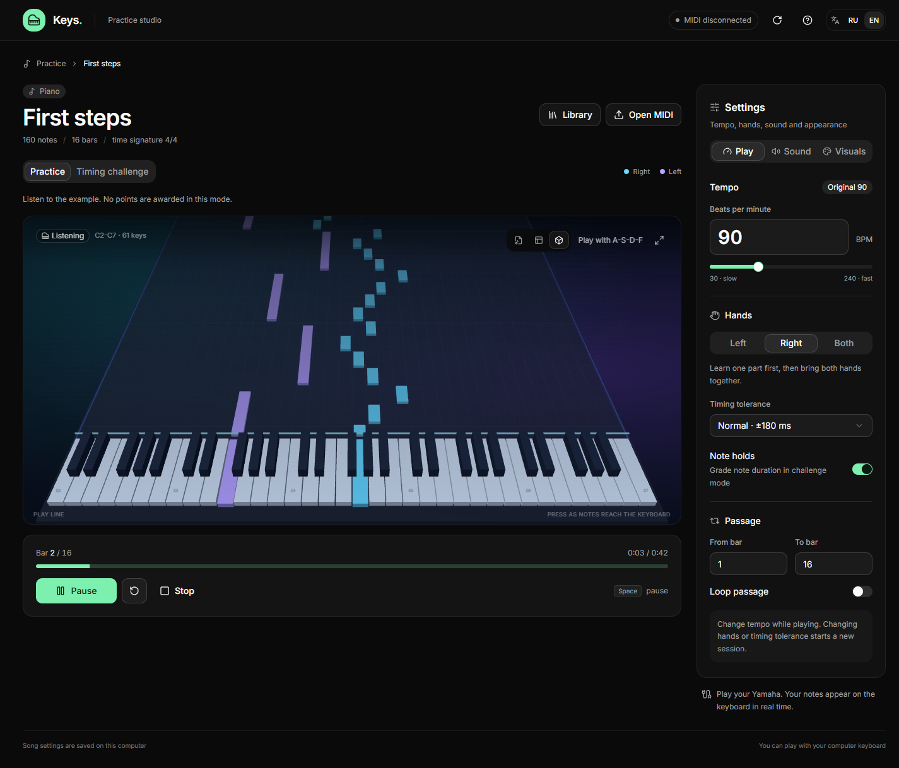
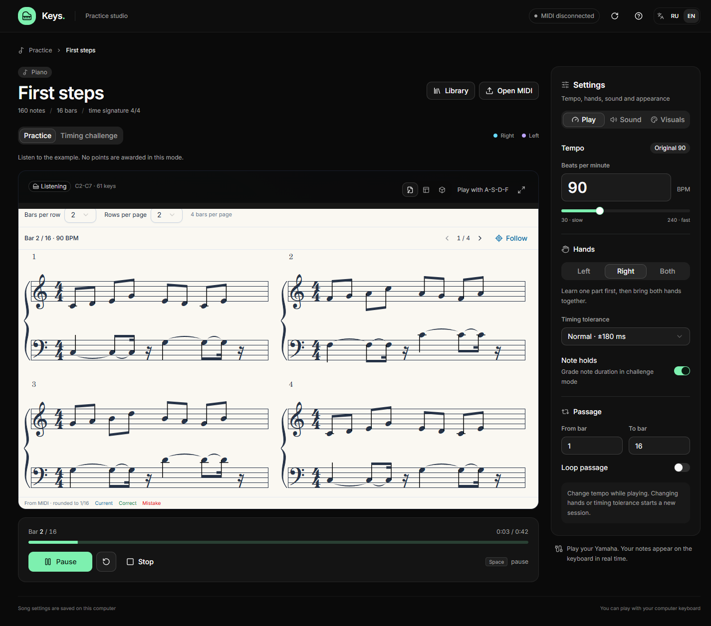

# Keys Studio

[Русский](README.ru.md) · English

A small piano practice app for your MIDI keyboard. Open a song, slow it down, and learn one hand at a time.



## Play your way

- Switch between a 3D piano roll, a top-down view, and sheet music.
- Practice at your own pace, or play for timing, scores, and streaks.
- Listen to a piece with the keys playing along. Change tempo and instrument without restarting.
- Import MIDI, choose a hand or a passage, and loop the tricky part.
- Keep each song's settings locally. Share a song and its settings as a `.pianopack` file.
- Adjust note colors, brightness, backgrounds, and the number of measures on a sheet.



## Run locally

You'll need **Windows, Node.js 22+, Python 3.10+, and a recent Chrome or Edge**. The MIDI bridge uses Windows' built-in WinMM API; no Python packages are needed. Switch between English and Russian with **EN / RU** in the header. Your choice is saved in this browser.

```powershell
git clone https://github.com/intrider-dev/keys-studio.git
cd keys-studio
npm ci
npm run build
.\start.cmd
```

The app opens at **http://127.0.0.1:8765**. Connect your keyboard by USB before starting. It was developed with a Yamaha YPT-370; other devices supported by WinMM may work but haven't been verified. You can also use the computer keyboard or click the piano keys.

Start with the included practice study, or use **Open MIDI** to import your own piece. **Library** opens the library. Space pauses and resumes playback.

For development, keep the local server running and use `npm run dev`. To test MIDI output, use the built app on port 8765; the bridge restricts write requests to that origin.

```powershell
npm test
python -m unittest discover -s tests -p test_bridge.py
npm run build
```

## A few things to know

Song files and preferences stay in your browser's local storage database. Export anything you want to keep before clearing browser data. There are no accounts or cloud sync.

The sheet view is generated from MIDI, with rhythm rounded to sixteenth notes. It isn't a copy of the original score. Notes outside the supported C2-C7 keyboard range are shifted by octaves on import.

The public version includes a simple synthesized preview sound. The 128 General MIDI choices can control a connected keyboard; sampled browser instruments require separately supplied banks. Downloaded songs, sound banks, and the optional character model are **not included**. Their licenses are separate from this project's code; see [asset notes](ASSETS.md).

Built with React, TypeScript, shadcn/ui, Three.js, VexFlow, and a small Python MIDI bridge.

## License

[MIT](LICENSE) for the project code and included practice study. Third-party dependencies and optional assets retain their own licenses.
