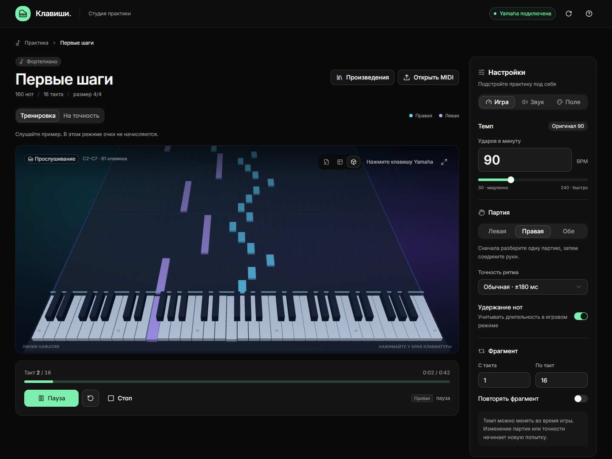
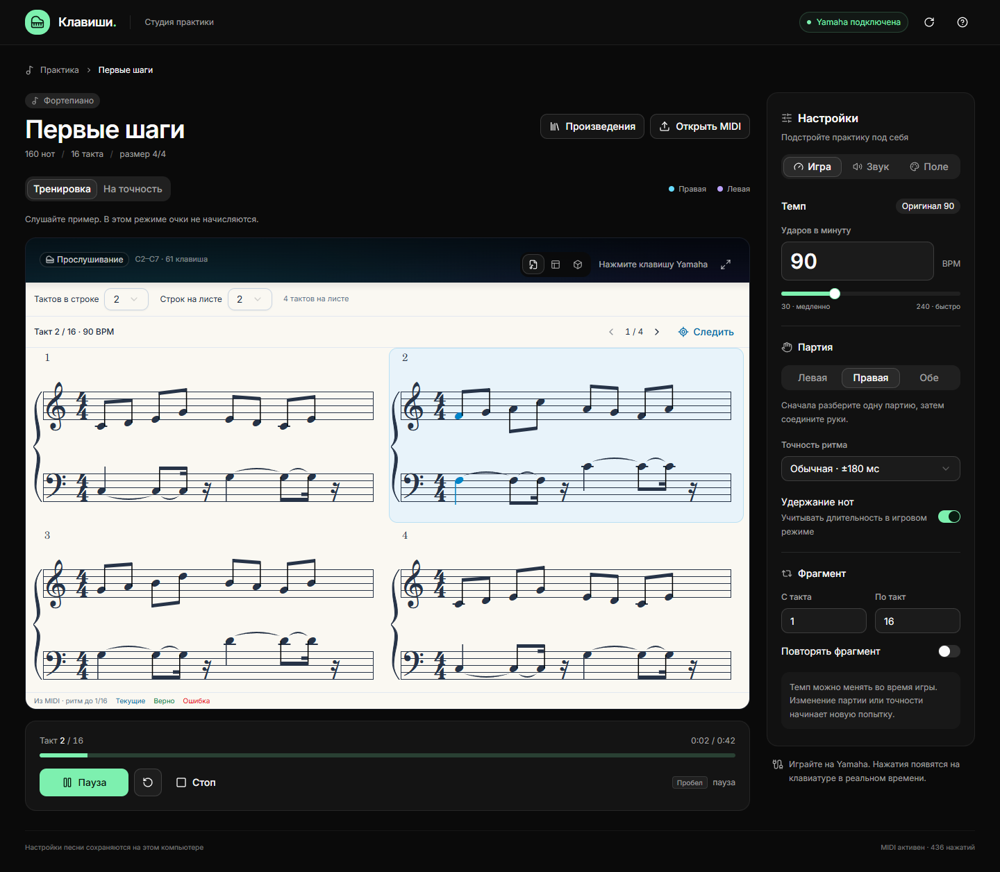

# Keys Studio

Русский · [English](README.md)

Небольшой тренажёр для MIDI-клавиатуры. Откройте произведение, замедлите темп и разберите его по одной руке.



## Что умеет

- Показывает падающие ноты в 3D, вид сверху или нотный лист.
- Ждёт правильного нажатия в тренировке, а в игре оценивает ритм, считает очки и серии.
- Проигрывает пример и подсвечивает клавиши. Темп и инструмент можно менять без перезапуска.
- Открывает MIDI, позволяет выбрать руку, фрагмент и повторять сложное место.
- Сохраняет настройки для каждой песни. Песней вместе с настройками можно поделиться через `.pianopack`.
- Позволяет настроить цвета, яркость, фон и количество тактов на нотном листе.



## Как запустить

Нужны **Windows, Node.js 22+, Python 3.10+ и свежий Chrome или Edge**. Для MIDI используется встроенный в Windows WinMM; дополнительные пакеты Python не нужны. Интерфейс пока на русском.

```powershell
git clone https://github.com/intrider-dev/keys-studio.git
cd keys-studio
npm ci
npm run build
.\start.cmd
```

Откроется **http://127.0.0.1:8765**. Подключите клавиатуру по USB до запуска. Проект разрабатывался с Yamaha YPT-370. Другие устройства с поддержкой WinMM могут работать, но пока не проверены. Можно играть и с компьютерной клавиатуры или нажимать клавиши мышью.

В комплекте есть учебный этюд. Свои файлы добавляйте через **«Открыть MIDI»**, библиотека находится в **«Произведениях»**. Пробел ставит воспроизведение на паузу и продолжает его.

Для разработки оставьте локальный сервер запущенным и выполните `npm run dev`. MIDI-выход проверяйте в собранной версии на порту 8765: сервер принимает команды только с этого адреса.

```powershell
npm test
npm run build
```

## Что важно знать

Песни и настройки хранятся в базе браузера на вашем компьютере. Перед очисткой данных браузера экспортируйте нужные произведения. Аккаунтов и облачной синхронизации нет.

Нотный лист строится из MIDI с округлением ритма до шестнадцатых. Он не повторяет исходную печатную партитуру. Ноты за пределами клавиатуры C2-C7 при импорте переносятся по октавам.

В публичной версии есть простой синтезированный звук для прослушивания. Через 128 тембров General MIDI можно управлять подключённой клавиатурой; для сэмплированного звука в браузере нужны отдельные банки. Скачанные песни, сэмплы и необязательная модель персонажа **не входят в репозиторий**. У них отдельные права использования: подробнее в [описании материалов](ASSETS.md).

Внутри: React, TypeScript, shadcn/ui, Three.js, VexFlow и небольшой MIDI-сервер на Python.

## Лицензия

[MIT](LICENSE) для кода проекта и учебного этюда. У сторонних библиотек и дополнительных материалов свои лицензии.
